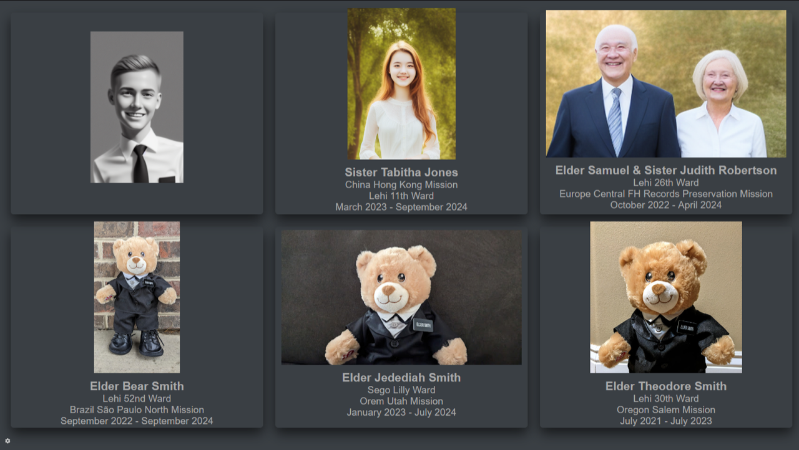
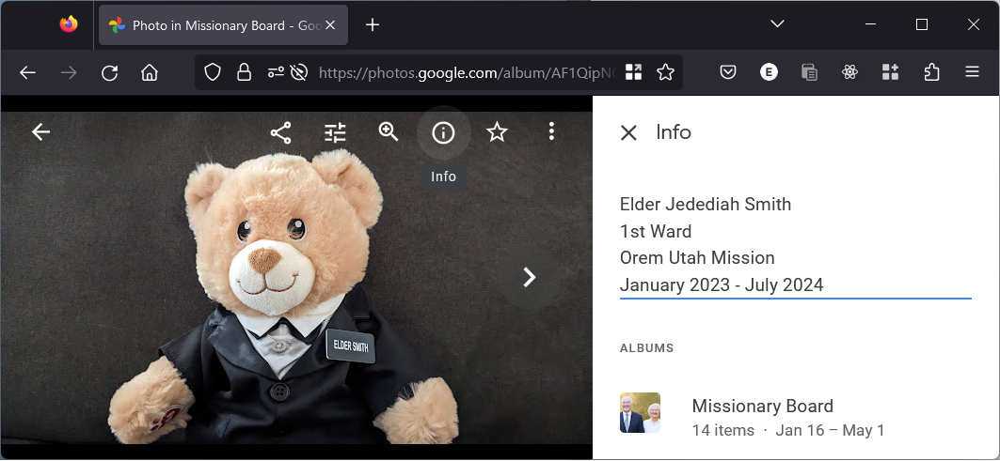

# Missionary Board

A digital missionary board/slideshow that integrates with Google Photos.

It can be run on an Orange Pi/Raspberry Pi and connected to a television screen to
create a kiosk.



The application synchronizes the photos from a Google Photos album that you call
"Missionary Board". The text from the photo's description is displayed under the picture
on the board, with the assumption that the first line will be the missionary's name.



TODO:

- Turn on/off with schedule?

## Device set up

This runs the Missionary Board server under Docker, pulling from my [Dockerhub
image](https://hub.docker.com/repository/docker/genericmoniker/mboard/general). Adapt as
desired.

The process was tested on Debian Buster running on an Orange Pi 3 LTS. Except where
noted, the steps should be run on the *Pi device*, either with an attached keyboard and
screen or by using ssh to connect to the device over the network.

Install the unclutter package for hiding the mouse cursor, and the xdotool to make it
easier to refresh the browser from the command line.

```
sudo apt-get install unclutter xdotool
```

Install Docker following the instructions for Debian from the
[documentation](https://docs.docker.com/engine/install/debian/#install-using-the-convenience-script),
including adding your user to the `docker` group in the [post install
instructions](https://docs.docker.com/engine/install/linux-postinstall/).

Create some directories:

```
mkdir ~/mboard
mkdir ~/mboard/instance
mkdir ~/mboard/system
```

Copy the contents of the `system` directory in this project to the Pi. One way of doing
this (among many) would be with with scp from another machine:

```
scp * orangepi@my-device-ip-address-here:~/mboard/system/
```

Back on the device, install and enable the mboard.service:

```
sudo cp ~/mboard/system/mboard.service /etc/systemd/system/
sudo systemctl enable mboard
```

Install the desktop files to autostart the browser and unclutter:

```
cp ~/mboard/system/*.desktop ~/.config/autostart/
```

Make sure the run script has executable permission, then run it.

```
chmod +x ~/mboard/system/run.sh
~/mboard/system/run.sh
```

After pulling the Docker image, the applications starts running at
http://127.0.0.1:8000.

The same run command above can be use to update the application by pulling a new Docker
image if one is available.

Finally, in my experience it is a good idea to reboot the device occasionally to keep
things running smoothly. For example, to reboot every Wednesday at 2 AM run:

```
sudo crontab -e
```

And add this entry to the file:

0 2  * * 3 /sbin/shutdown -r


## Board set up

TODO...

## Development

The application is written in Python using the [Starlette](https://www.starlette.io/)
framework. Dependencies are managed with [PDM](https://pdm.fming.dev/latest/). Follow
the installation instructions on the PDM web site, then run:

```
pdm install
```

After the dependencies install, you can run other commands with `pdm run`, such as the
following, which will run the server in development mode with auto-reload:

```
pdm run dev
```

You can see other commands by running:

```
pdm run --list
```

There is a Git pre-commit hook for the project that can be installed by running:

```
pdm run pre-commit install
```

### Styles

CSS styling uses the [Bulma](https://bulma.io) framework. The compiled
`static/styles.css` file is included in the repository, but to rebuild it:

1. Install [sass](https://sass-lang.com/install) and make sure it is in your PATH (e.g.
   `~/.local/bin` on Linux).
2. Run `pdm run styles`
