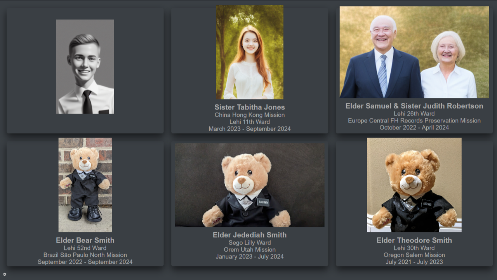
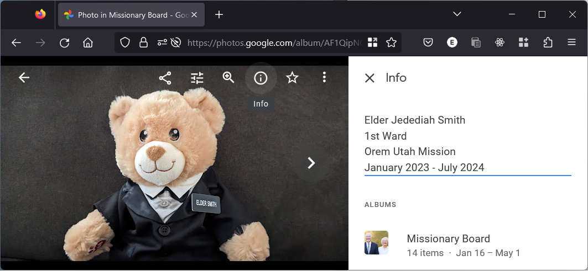

# Missionary Board

A digital missionary board/slideshow that integrates with Google Photos.

It can be run on an Orange Pi/Raspberry Pi and connected to a television screen
to create a kiosk.



The application synchronizes the photos from a Google Photos album that you call
"Missionary Board". The text from the photo's description is displayed under the
picture on the board, with the assumption that the first line will be the
missionary's name.



The first time the web application is run, you'll be prompted to set an admin
password and will be given instructions on setting up an application in your
Google account and getting it authorized to read from your Google Photos.

## Device set up

The process was tested on Debian Buster running on an Orange Pi 3 LTS. Except
where noted, the steps should be run on the *Pi device*, either with an attached
keyboard and screen or by using ssh to connect to the device over the network.

Clone this repo:

```
git clone https://github.com/genericmoniker/missionary-board.git
```

Install the unclutter package for hiding the mouse cursor, and the xdotool to
make it easier to refresh the browser from the command line.

```
sudo apt-get install unclutter xdotool
```

Run the install script:

```
cd missionary-board
./install.sh
```

After running the install script, the backend application runs at
http://127.0.0.1:8000.

The same run command above can be use to update the application by pulling a new
Docker image if one is available.

Finally, in my experience it is a good idea to reboot the device occasionally to
keep things running smoothly. For example, to reboot every Wednesday at 2 AM
run:

```
sudo crontab -e
```

And add this entry to the file:

```
0 2  * * 3 /sbin/shutdown -r
```

## Board set up

Follow the instructions in the web application when running it the first time.

## Troubleshooting

Logs are available via `journalctl`:

```
journalctl --user -u mboard*
```

You may want to configure logs to be persistent between reboots. To do so:

```
sudo nano /etc/systemd/journald.conf
```

Uncomment and set the Storage option to persistent:

```
[Journal]
Storage=persistent
```

## Development

The application is written in Python using the
[Starlette](https://www.starlette.io/) framework. Dependencies are managed with
[uv](https://docs.astral.sh/uv/). Follow the installation instructions on
the uv web site, then run:

```
uv sync
```

After the dependencies install, you can run other commands with `pdm run`, such
as the following, which will run the server in development mode with
auto-reload:

```
pdm run dev
```

You can see other commands by running:

```
pdm run --list
```

There is a Git pre-commit hook for the project that can be installed by running:

```
pdm run pre-commit install
```

### Styles

CSS styling uses the [Bulma](https://bulma.io) framework. The compiled
`static/styles.css` file is included in the repository, but to rebuild it:

1. Install [sass](https://sass-lang.com/install) and make sure it is in your
   PATH (e.g. `~/.local/bin` on Linux).
2. Run `pdm run styles`
